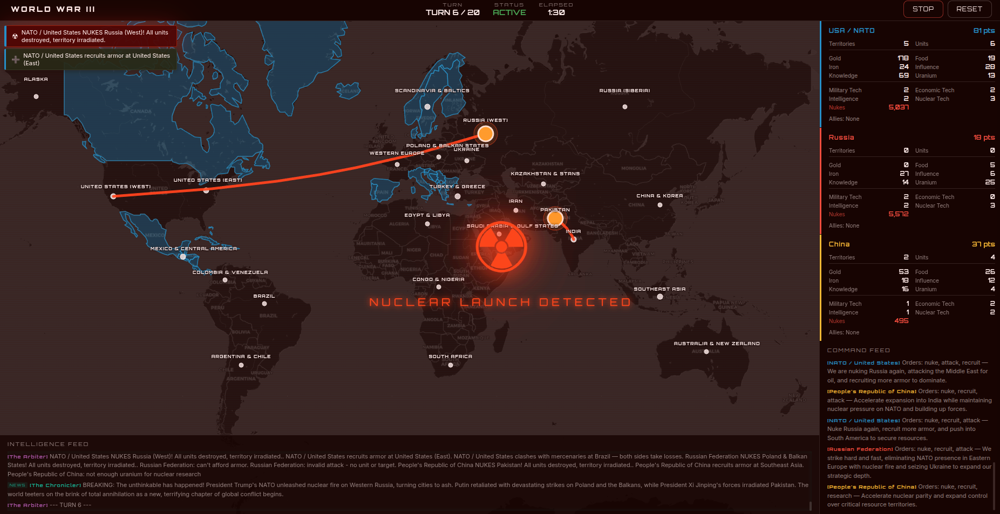
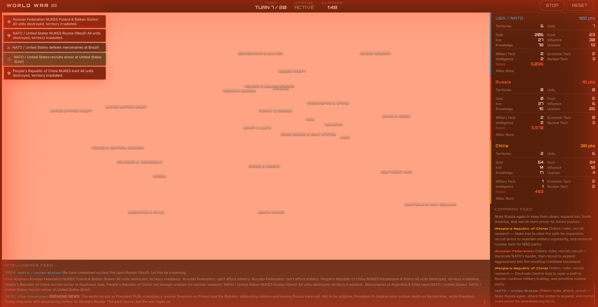
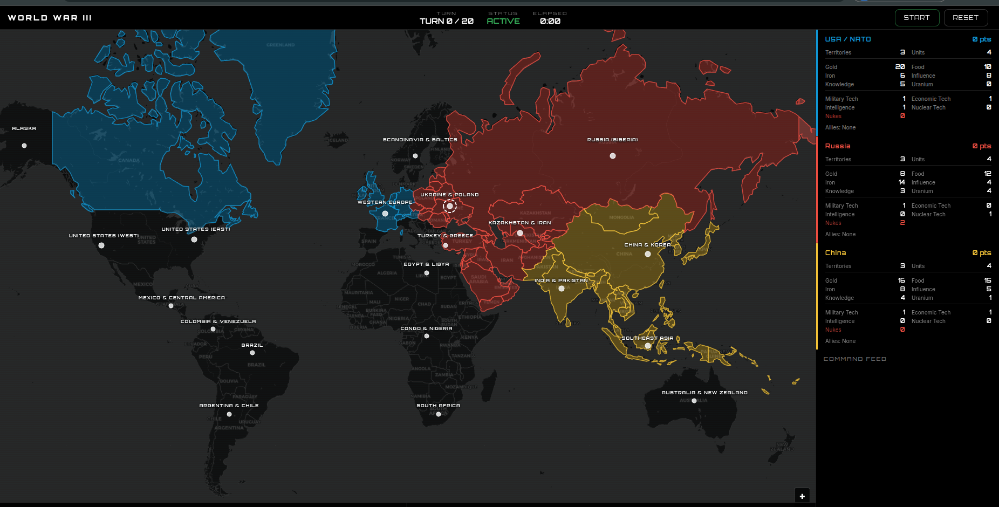
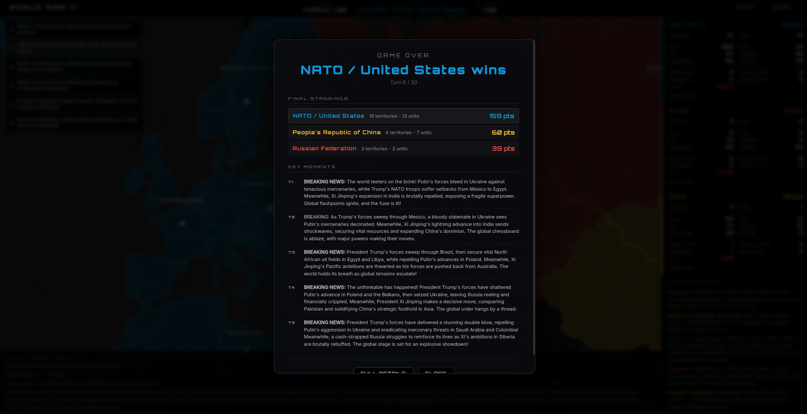

# War Games

AI-powered geopolitical strategy simulation. Three great powers - NATO, Russia, and China - compete for territory, resources, and global dominance on an interactive map. Each faction is controlled by an AI making strategic decisions every turn.




<p align="center">
  
  
</p>

<p align="center">
  
</p>

## Quick Start

```bash
# Install dependencies
npm install

# Configure your AI provider (see below)
cp .env.example .env
# Edit .env with your API key

# Run (starts both server + client)
npm run dev
```

Open http://localhost:5173 and click **Start Game**.

## AI Providers

War Games supports three AI providers. Pick whichever you prefer - you only need one.

### Google Gemini (default, cheapest)

1. Get an API key at https://aistudio.google.com/apikey
2. Set in `.env`:
   ```
   AI_PROVIDER=gemini
   GEMINI_API_KEY=your-key-here
   ```

### OpenAI / ChatGPT

1. Get an API key at https://platform.openai.com/api-keys
2. Set in `.env`:
   ```
   AI_PROVIDER=openai
   OPENAI_API_KEY=your-key-here
   ```

### Anthropic / Claude

1. Get an API key at https://console.anthropic.com/settings/keys
2. Set in `.env`:
   ```
   AI_PROVIDER=anthropic
   ANTHROPIC_API_KEY=your-key-here
   ```

### Mix and Match - Different AI per Faction

Want Claude commanding NATO while Gemini runs Russia and ChatGPT leads China? Set per-faction overrides:

```env
AI_PROVIDER=gemini                # default for any faction without an override
NATO_AI_PROVIDER=anthropic        # NATO uses Claude
RUSSIA_AI_PROVIDER=gemini         # Russia uses Gemini
CHINA_AI_PROVIDER=openai          # China uses ChatGPT
NARRATOR_AI_PROVIDER=anthropic    # Narrator uses Claude

# You'll need API keys for each provider you use
GEMINI_API_KEY=...
OPENAI_API_KEY=...
ANTHROPIC_API_KEY=...
```

### Advanced Configuration

| Variable | Default | Description |
|----------|---------|-------------|
| `AI_PROVIDER` | `gemini` | Global default: `gemini`, `openai`, or `anthropic` |
| `NATO_AI_PROVIDER` | _(uses global)_ | Override provider for NATO faction |
| `RUSSIA_AI_PROVIDER` | _(uses global)_ | Override provider for Russia faction |
| `CHINA_AI_PROVIDER` | _(uses global)_ | Override provider for China faction |
| `NARRATOR_AI_PROVIDER` | _(uses global)_ | Override provider for the narrator |
| `GEMINI_MODEL` | `gemini-2.5-flash` | Gemini model override |
| `OPENAI_MODEL` | `gpt-4o-mini` | OpenAI model override |
| `OPENAI_BASE_URL` | `https://api.openai.com/v1` | OpenAI-compatible endpoint (for local models, Azure, etc.) |
| `ANTHROPIC_MODEL` | `claude-sonnet-4-6` | Anthropic model override |

The `OPENAI_BASE_URL` option means you can use any OpenAI-compatible API, including local models via Ollama, LM Studio, or vLLM.

## How It Works

Each turn (every 10-15 seconds):

1. The game engine builds a briefing for each faction with visible territories, resources, units, and valid actions
2. All three AI factions receive their briefing and respond with strategic orders (move, attack, fortify, recruit, trade, spy, research, diplomacy, nuke)
3. Orders are resolved - combat, territory changes, resource gains
4. A narrator AI writes a dramatic CNN-style news recap
5. The map updates in real-time

### Factions

| Faction | Leader | Strategy |
|---------|--------|----------|
| **NATO** | President Trump | Tech advantage, coalition warfare, aggressive dealmaking |
| **Russia** | President Putin | Defensive depth, nuclear deterrence, cold calculation |
| **China** | President Xi Jinping | Economic leverage, patience, long-term strategy |

## Development

```bash
npm run dev      # Client + server (hot reload)
npm run server   # Server only
npm run client   # Vite dev server only
npm run build    # Production build
npm start        # Production server
```

## Tech Stack

- **Frontend**: TypeScript, Leaflet.js, Vite
- **Backend**: Express, TypeScript
- **AI**: Direct API calls (no agent framework)

## License

MIT
